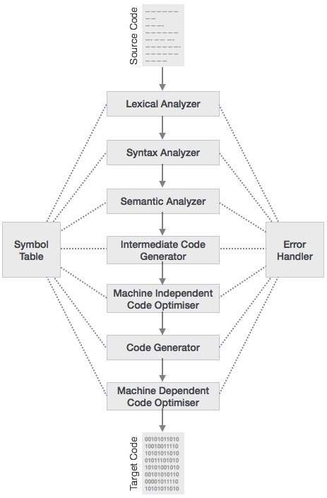

# Compiler-Project-in-Natural-Bangla
## Introduction
A compiler is computer software that transforms computer code written in one programming language (the source language) into another programming language (the target language). Compilers are a type of translator that support digital devices, primarily computers. The name compiler is primarily used for programs that translate source code from a high-level programming language to a lower level language (e.g., assembly language, object code, or machine code) to create an executable program.

## Phases of compilation
The compilation process is a sequence of various phases. Each phase takes input from its previous stage, has its own representation of source program, and feeds its output to the next phase of the compiler. Let us understand the phases of a compiler.



In my project, I have gone done two phases. That are
1. Lexical Analysis
2. Syntax Analysis

### Lexical Analysis
I have used flex to generate token from the string of yytext. Then i returned those to the bison file for Syntax Analysis.

### Syntax Analysis
For syntax analysis, I have used bison. My type for bison is :
```
%union {
  double DOB;
  int IN;
  char *id;
}
```
And for variable symbol table, the struct is :
```
struct valueid {
		char *name;
		int type;
		double val;
}
```

## Rules for syntax analysis
sentence -> sentence ghoshona
		|	sentence subsent
ghoshona -> Variable ASSIGN TYPE shesh
		|	Variable ASSIGN TYPE expression shesh
TYPE	 -> INT | FLOAT
subsent	 -> shesh
		|	Variable ASSIGN expression shesh
        |	expression shesh
        |	JODI bool_expr BOOL_EXPR_CLOSE STMNT_BLOCK
        |	JODI bool_expr BOOL_EXPR_CLOSE STMNT_BLOCK NAHOY STMNT_BLOCK
        |	JODI bool_expr BOOL_EXPR_CLOSE STMNT_BLOCK ELSE_IF_BLOCK NAHOY STMNT_BLOCK
        |	Variable DIE expression THAN expression FOR STMNT_BLOCK
        |	Switch Variable Cases END_BLOCK
        |	Variables FUNCTION STMNT_BLOCK
Variables-> Variable | Variable AR Variables
Cases	 -> Case Cases | :epsilon:
Case	 -> Number HOLE STMNT_BLOCK
ELSE_IF_BLOCK->ELSE_IF bool_expr BOOL_EXPR_CLOSE STMNT_BLOCK ELSE_IF_BLOCK | :epsilon:
STMNT_BLOCK->START_BLOCK sentence END_BLOCK
expression->Number
		|	Variable
        |	expression SUM expression
        |	expression SUM expression
        |	expression SUB expression
        |	expression MUL expression
        |	expression DIV expression
        |	expression SINE
        |	expression COS
        |	expression TAN
        |	expression LN
        |	expression FACTORIAL
bool_expr-> expression THAN expression ISLESS
		|	expression THAN expression ISGREATER
        |	expression THAN expression ISGREATEREQU
        |	expression THAN expression ISLESSEQU
        |	bool_expr AND bool_expr
        |	bool_expr OR bool_expr
        |	bool_expr NOT
        |	LP bool_expr RP

## Sample input
```Bangla
// Declaration with no value
abc holo purno #
def holo vognangsho #

// Declaration with value
a holo purno 5 #
b holo vognangsho 10.1 #

// Conditions
jodi a theke b boro hoe
tahole
    c holo purno a jog b #
    // And other statements
shesh

// Assignments
a holo 10 #
a holo 15 jog 18 #


// Conditions with complex boolean expressions
jodi a theke b boro ebong 5 theke 6 boro na hoe
tahole
    // Statements
shesh

// If with else
jodi 5 theke 6 boro hoe
tahole
    // Statements
shesh
nahole
tahole
    // Statements
shesh

// If with else if and else
jodi 5 theke 6 boro hoe
tahole
    // Statements
shesh
nahole_jodi 5 theke 6 choto hoe
tahole
    // Statements
shesh
nahole
tahole
    // Statements
shesh

// Nested if else   ( No dangling else error :) )
jodi 5 theke 10 boro hoe
tahole
    jodi 10 theke a choto hoe
    tahole
        // Statements
    shesh
    nahole
    tahole
        // Statements
    shesh
shesh
nahole
tahole
    // Statements
shesh


// Operators
a jog b #
a biog b #
a gun b #
a vag b #

// Advanced Operators
a er_upore b #
a er_sine #
a er_cos #
a er_tan #
a er_lon #


// Loop
pachta holo purno #
i die 10 theke 20 ghurlam
tahole
    pachta holo 5 #
shesh

// Switch
a holo 6 #
dhori a
  5 hole
  tahole
    xyz holo purno 10 #
  shesh
  6 hole
  tahole
    jodi def theke abc boro hoe  // inserted if in switch, if you're wondering its possible in my language :)
    tahole
      ghi holo purno 15 #
    shesh
  shesh
shesh


// And now the error part

// declared previously
abc holo purno 10 #

// Undeclared variable
cba holo 5 #
```

## Sample output
```Bangla
Declared variable-> abc : 0.000000
Declared variable-> def : 0.000000
Declared variable-> a : 5
Declared variable-> b : 10.1
bool_expr boro: 1
Declared variable-> c : 15.1
Block Successfully Parsed
Expression in if is true
Updated variable-> a : 10
Updated variable-> a : 33
bool_expr boro: 0
bool_expr boro: 1
bool_expr ebong: 0
bool_expr na: 1
Block Successfully Parsed
Expression in if is true
bool_expr boro: 1
Block Successfully Parsed
Block Successfully Parsed
Expression in if is true
bool_expr boro: 1
Block Successfully Parsed
bool_expr choto: 0
Block Successfully Parsed
Expression in else if is : true
Block Successfully Parsed
Expression in if is true
bool_expr boro: 1
bool_expr choto: 0
Block Successfully Parsed
Block Successfully Parsed
Expression in if is false
Block Successfully Parsed
Block Successfully Parsed
Expression in if is true
Value of expression: 43.1
Value of expression: 22.9
Value of expression: 333.3
Value of expression: 3.267326733
To the power value 2.172655117e+15
Value of expression: 2.172655117e+15
 sin value 0.5446401646
Value of expression: 0.5446401646
 cos value 0.8386698344
Value of expression: 0.8386698344
 tan value 0.649409508
Value of expression: 0.649409508
 ln value 3.496507561
Value of expression: 3.496507561
Declared variable-> pachta : 0.000000

Updated variable-> pachta : 5
Block Successfully Parsed
FOR : value of i : 10
FOR : value of i : 11
FOR : value of i : 12
FOR : value of i : 13
FOR : value of i : 14
FOR : value of i : 15
FOR : value of i : 16
FOR : value of i : 17
FOR : value of i : 18
FOR : value of i : 19
Updated variable-> a : 6

Declared variable-> xyz : 10
Block Successfully Parsed
Case 5 is done

bool_expr boro: 0
Declared variable-> ghi : 15
Block Successfully Parsed
Expression in if is false
Block Successfully Parsed
Case 6 is done
Successful Switch Statement with 
	variable a
	case : 6
Already Declared variable : abc !
Variable cba not declared!
```
